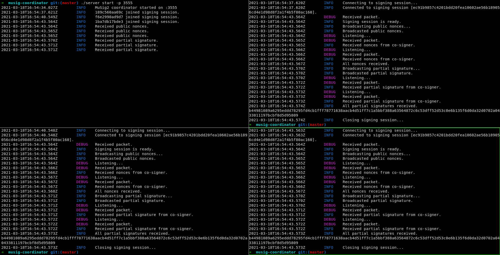

# MuSig2 Coordinator
Please consider this software insecure.  
[Blockstream's MuSig2](https://eprint.iacr.org/2020/1261.pdf) implementation in Go.

This software helps coordinating the signing process of a message between multiple co-signers using **MuSig2** based on Schnorr signatures.  
MuSig2 only requires 2 rounds of communication between co-signers.



## Server
### Usage
```bash
$ make server
$ ./server start -p 3555
```

## Client
### Compile
```bash
$ make client
```

### Sign
* Generate a key pair:
    ```bash
    $ ./client newkey ./mykey
    ```
* Sign your message:
    ```bash
    $ ./client sign "my message" -k ./mykey
    d0fd31d13672fcc3a8b6ead50259e1c58614d2de8c2a31c24e5c20d4f6e53813c40e2fe404396a578f9636b34d81969ff0afd7571569d7f6e298d7831f9cdc0f
    ```

### Sign with co-signers

* Each co-signer must first generate a key pair using:  
    ```bash
    $ ./client newkey ./mykey`
    ```
* Each co-signer's public key must be added to a `keyset` file such as:
    ```bash
    $ cat ./keyset
    f6e2990ad9d77189388f1b8bf47316231a21618780c836c2aea58a816c062301
    189c560aa69c87bc6ea84cafc85c655d62b0e4dde29a9c9bd803f2a8b82521ae
    1ba7db17bde3edece57d32ce4079969f4c53e5780ca3e6d0e0176c84fdc6e396
    ```

* Each co-signer must connect to the musig2 coordinator server using:
    ```bash
    $ ./client signmany -s localhost:3555 -k mykey -p ./keyset "message to sign"
    ```
The signing process begins.  
Once the process is done, each co-signer's partial signature is aggregated into a single 64 bytes schnorr signature such as:  
`1442c5ee87f7b81ec3f46cf46de5d6cb6f2cb340fb50d432d6275e689bbecbb0cf23096c757bc349d3abef44a06278de3298bda56af7a4f91467a038c9b82209`.

### Verification
* Simple verification: 
    ```bash
    $ ./client verify "message" "signature" "public key"
    ```
* Multi-sig verification:
    ```bash
    $ ./client verify "message" "signature" -p ./keyset
    ```

## License
MIT - Aurèle Oulès